# Traffic Scoring Validation Report (Google Maps Only)

## Urban Testing

| Location | Coordinates | Screenshot | Final Google Maps Score | Justification/Discrepancy Notes |
| --- | --- | --- | --- | --- |
| Loc-1 | 24.63, 46.69 | 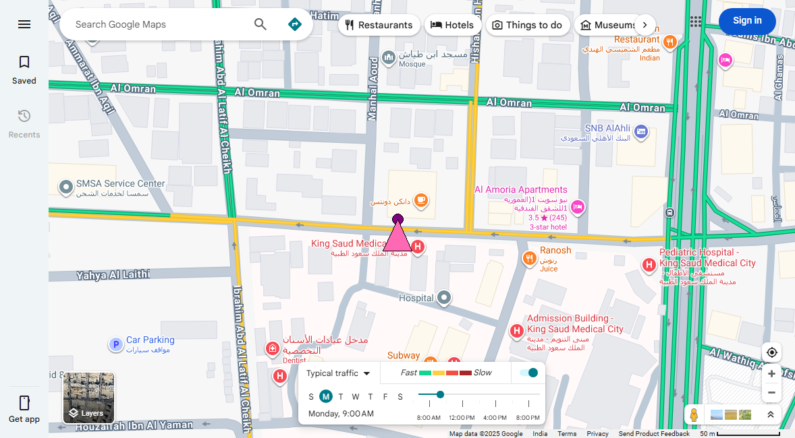 | 68.33 | Accurate: Good storefront traffic, moderate surrounding roads. |
| Loc-2 | 24.771, 46.703 | 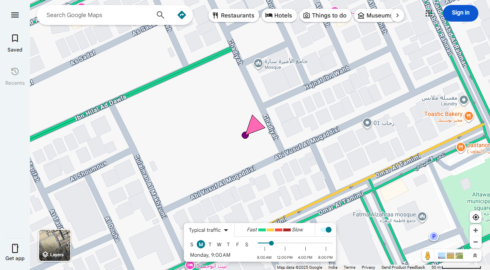 | 5.18 | Accurate: Very low traffic detected. |
| Loc-3 | 24.714, 46.684 |  | 30.36 | Accurate: Moderate storefront traffic, low surrounding roads. |
| Loc-4 | 24.72, 46.65 | 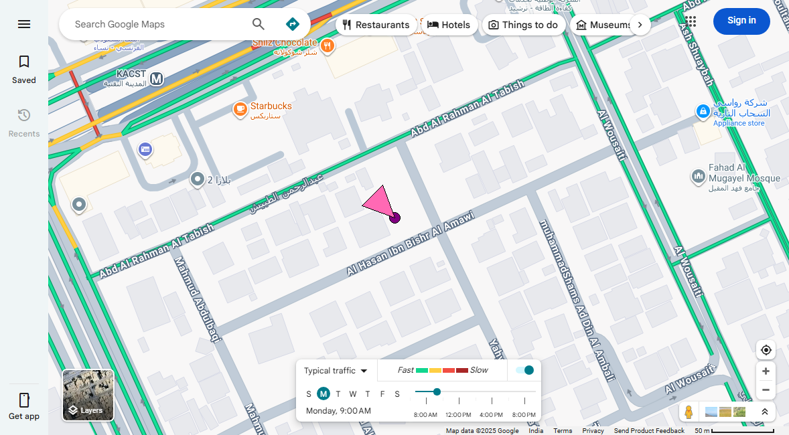 | 8.91 | Accurate: Low traffic detected. |
| Loc-5 | 24.8, 46.72 | 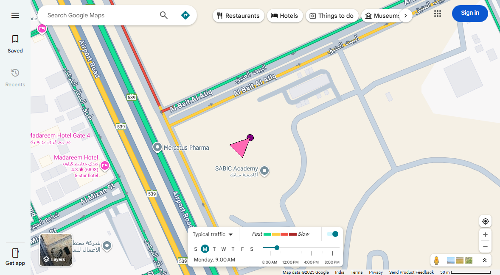 | 16.39 | Accurate: Low to moderate traffic detected. |
| Loc-6 | 24.714, 46.684 | 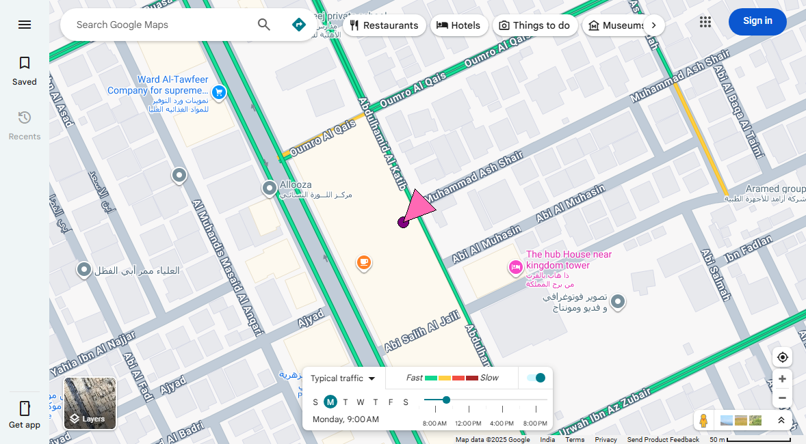 | 30.36 | Accurate: Moderate storefront traffic, low surrounding roads. |
| Loc-7 | 24.692, 46.706 | 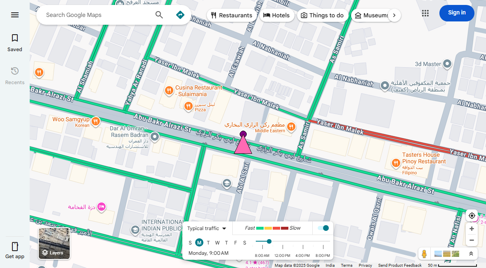 | 30.4 | Accurate: Moderate storefront traffic, low surrounding roads. |
| Loc-8 | 24.66, 46.71 | 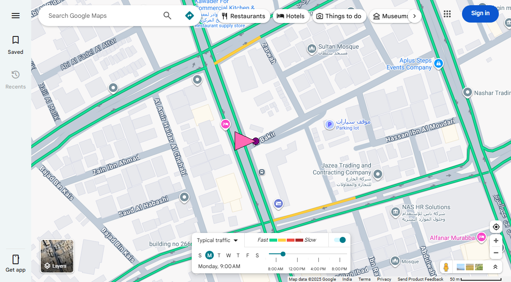 | 31.91 | Accurate: Moderate storefront traffic, low to moderate surrounding roads. |
| Loc-9 | 24.77, 46.58 | 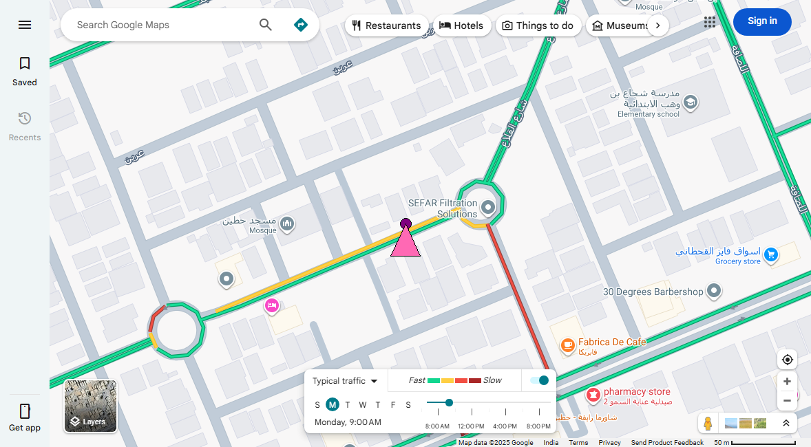 | 64.49 | Accurate: Good storefront traffic, moderate surrounding roads. |
| Loc-10 | 24.637, 46.715 | 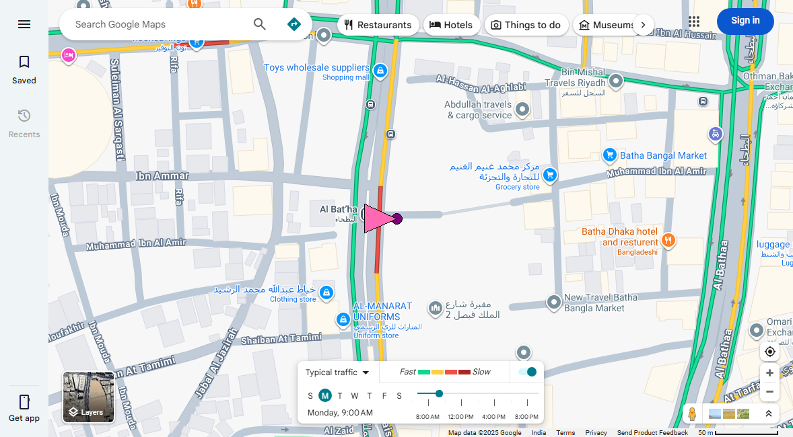 | 83.01 | Accurate: Excellent storefront traffic, good surrounding roads. |

## Suburban Testing

| Location | Coordinates | Screenshot | Final Google Maps Score | Justification/Discrepancy Notes |
| --- | --- | --- | --- | --- |
| Loc-11 | 24.577, 46.678 |  | 62.15 | Accurate: Good storefront traffic, moderate surrounding roads. |
| Loc-12 | 24.7378, 46.5755 | 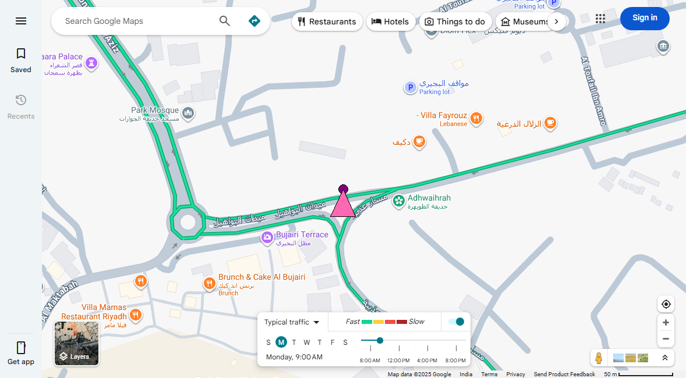 | 30.0 | Accurate: Moderate storefront traffic, low surrounding roads. |
| Loc-13 | 24.55, 46.8 | 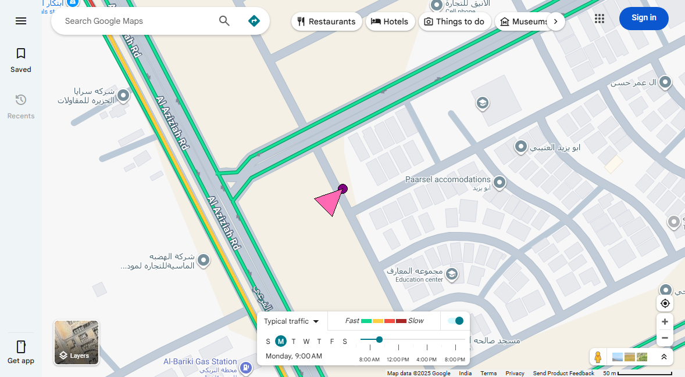 | 8.91 | Accurate: Low traffic detected. |
| Loc-14 | 24.9582, 46.7008 | 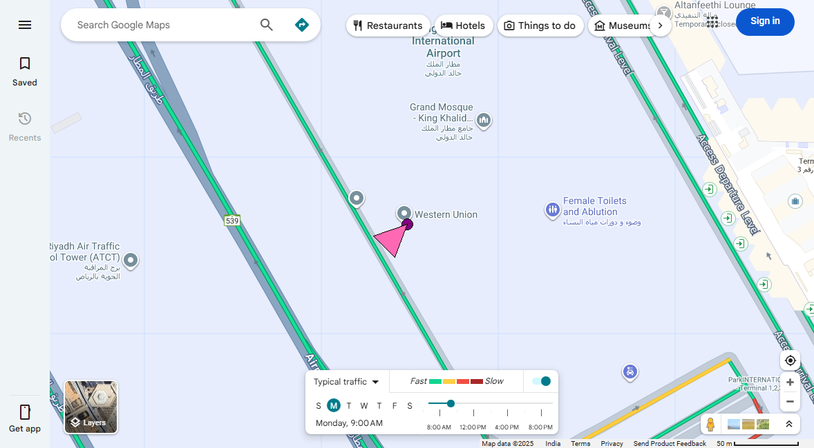 | 30.0 | Accurate: Moderate storefront traffic, low surrounding roads. |
| Loc-15 | 24.6325, 46.715 | 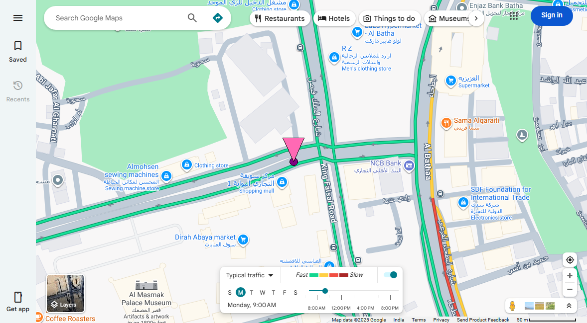 | 30.0 | Accurate: Moderate storefront traffic, low surrounding roads. |

## Remote Testing

| Location | Coordinates | Screenshot | Final Google Maps Score | Justification/Discrepancy Notes |
| --- | --- | --- | --- | --- |
| Loc-16 | 25.0, 46.5 | 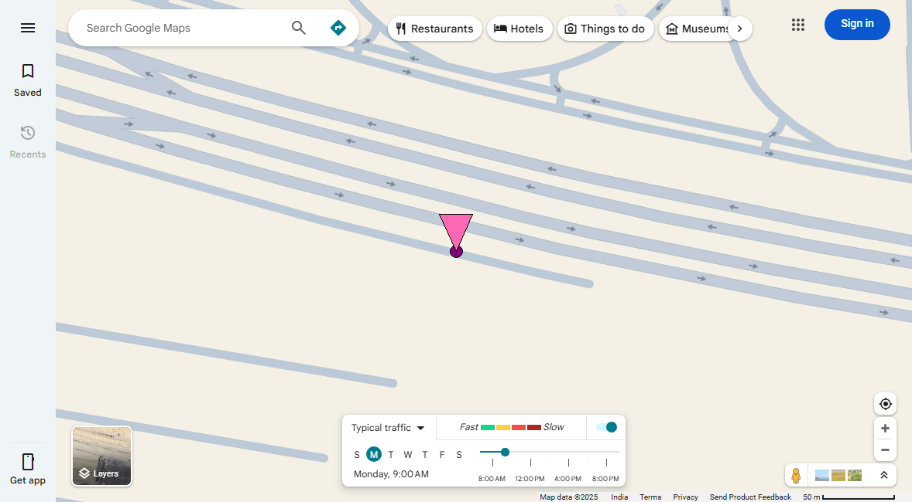 | 0.0 | Accurate: No traffic detected. |
| Loc-17 | 24.3, 46.4 | 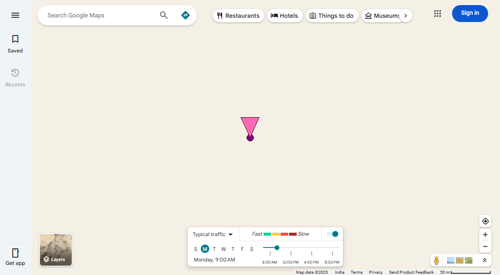 | 0.0 | Accurate: No traffic detected. |

## Notes

- Validation uses only Google Maps visual traffic colors.
