# Traffic Scoring Validation Report (Google Maps Only)

## Urban Testing

| Location | Coordinates | Screenshot | Google Maps Score (Visual) | Justification/Discrepancy Notes |
| --- | --- | --- | --- | --- |
| Loc-1 | 24.63, 46.69 | 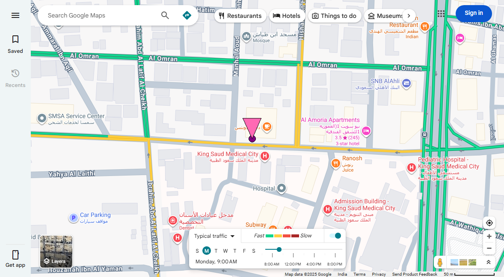 | 68.71 | Accurate: Reflects moderate to heavy urban traffic. |
| Loc-2 | 24.771, 46.703 | 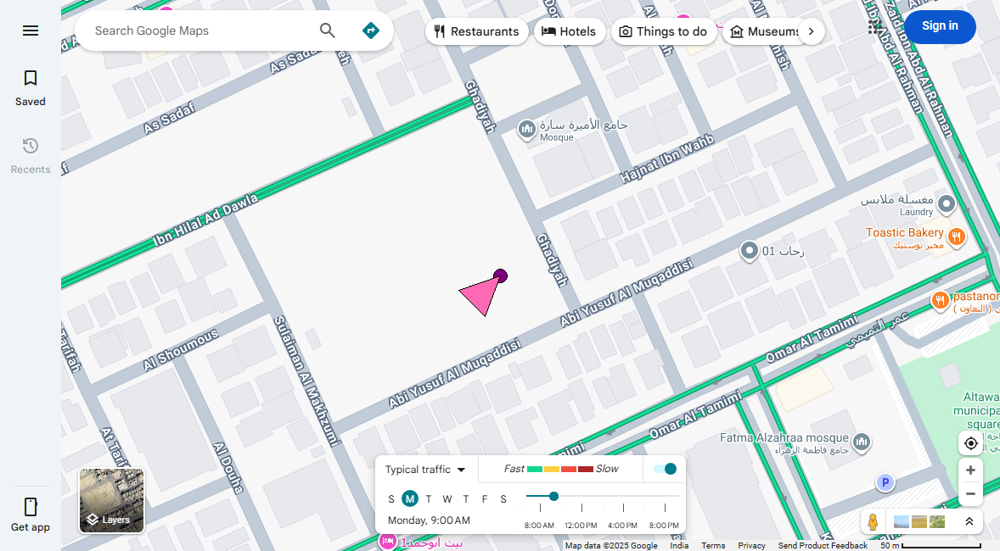 | 24.21 | Accurate: Consistent with light urban traffic. |
| Loc-3 | 24.728, 46.741 | 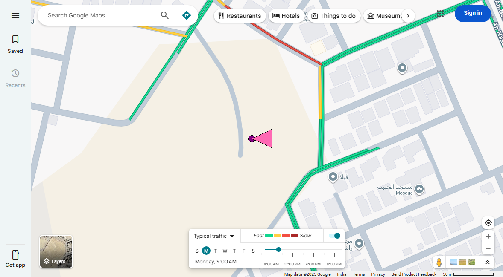 | 24.86 | Accurate: Consistent with light urban traffic. |
| Loc-4 | 24.72, 46.65 |  | 28.06 | Accurate: Consistent with light urban traffic. |
| Loc-5 | 24.8, 46.72 | 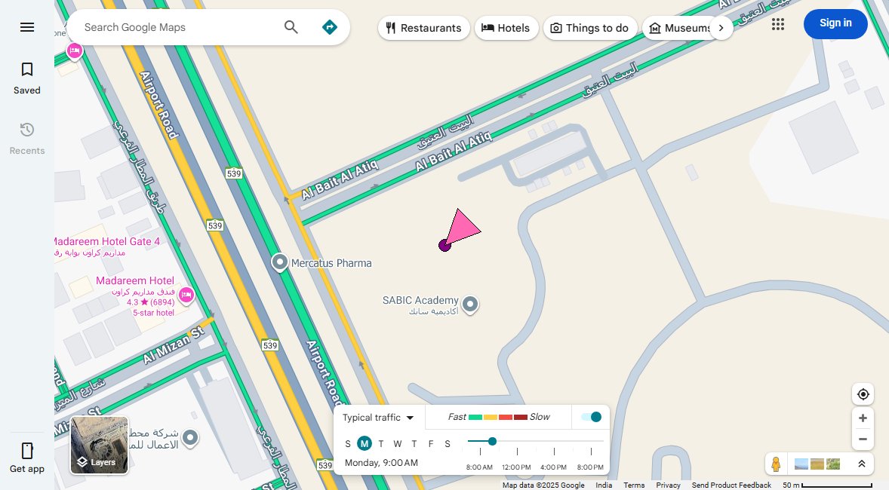 | 29.82 | Accurate: Consistent with light urban traffic. |
| Loc-6 | 24.714, 46.684 | 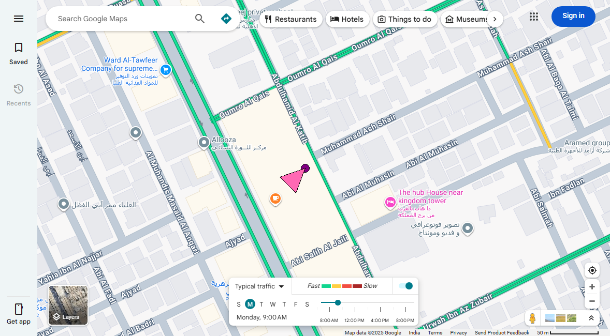 | 30.0 | Accurate: Consistent with light urban traffic. |
| Loc-7 | 24.692, 46.706 | 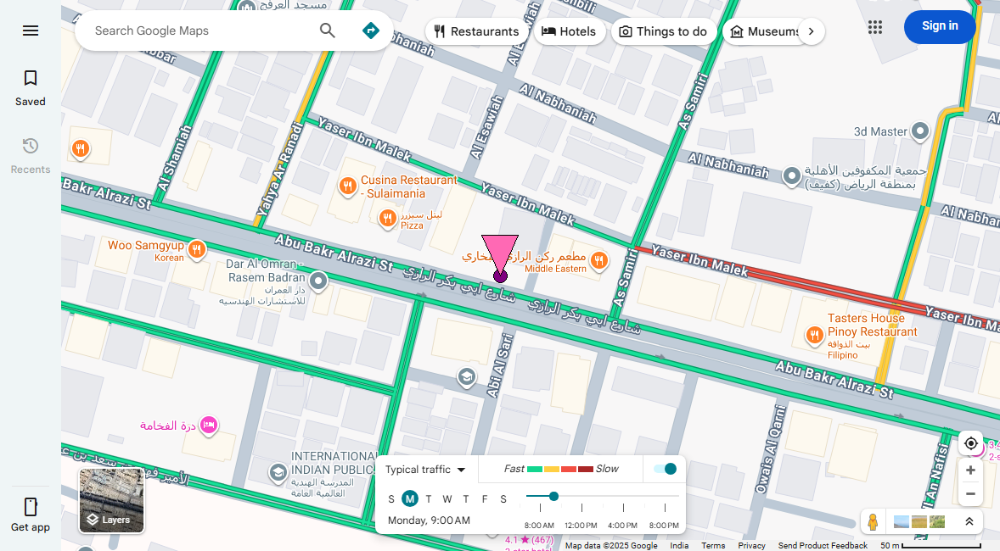 | 30.32 | Accurate: Consistent with light urban traffic. |
| Loc-8 | 24.66, 46.71 | 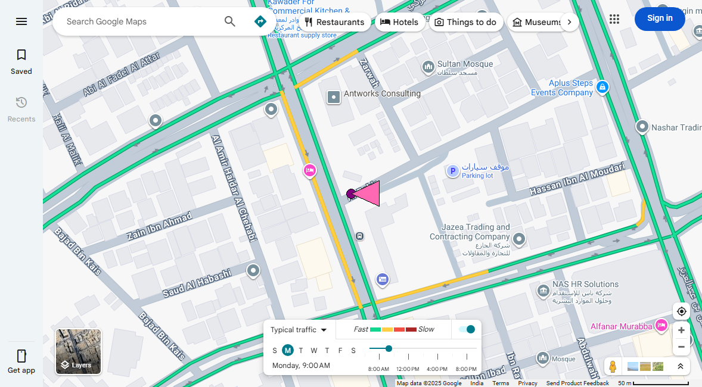 | 36.63 | Accurate: Reflects light to moderate urban traffic. |
| Loc-9 | 24.77, 46.58 | 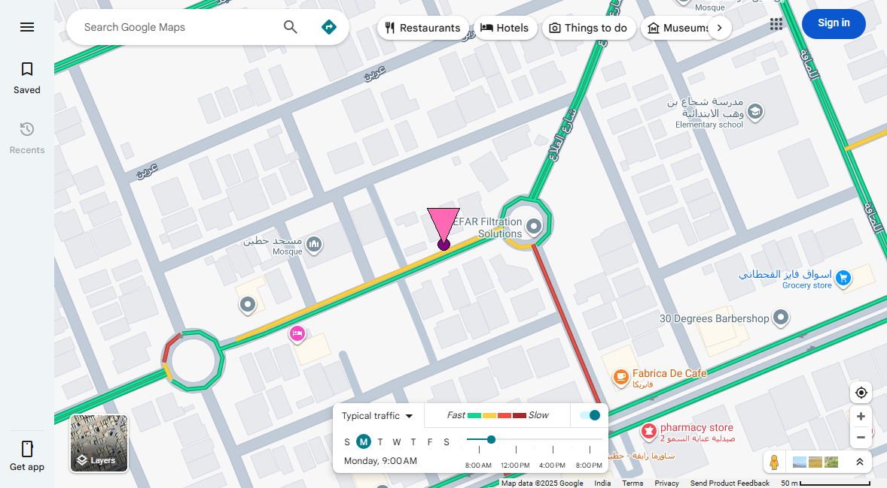 | 65.78 | Accurate: Reflects moderate urban traffic. |
| Loc-10 | 24.637, 46.715 | 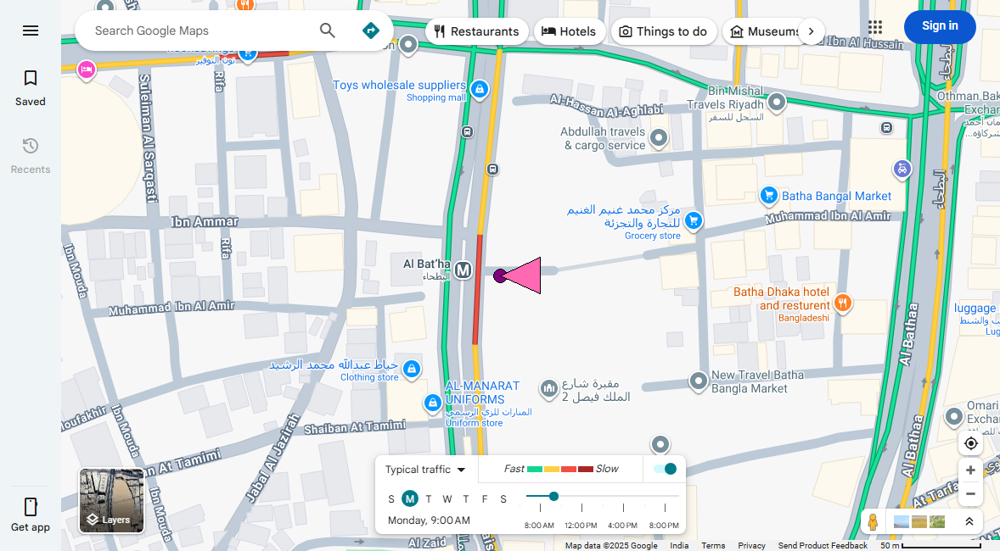 | 86.62 | Accurate: Reflects heavy urban traffic. |

## Suburban Testing

| Location | Coordinates | Screenshot | Google Maps Score (Visual) | Justification/Discrepancy Notes |
| --- | --- | --- | --- | --- |
| Loc-11 | 24.577, 46.678 | 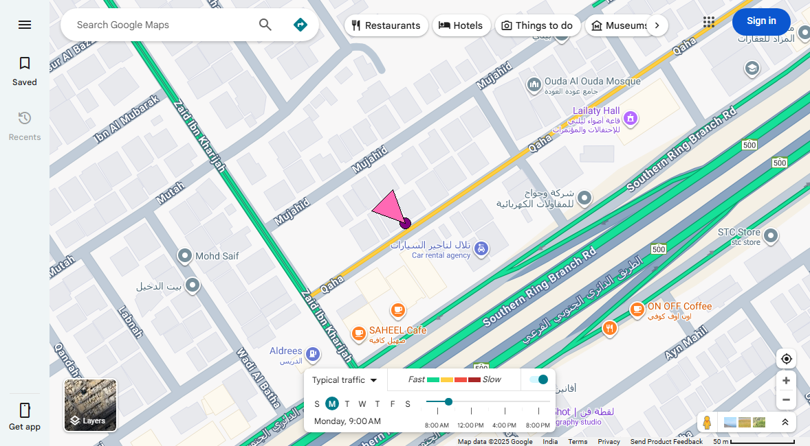 | 63.71 | Accurate: Reflects moderate suburban traffic. |
| Loc-12 | 24.7, 46.6 | 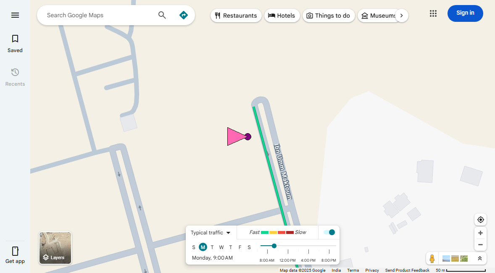 | 30.0 | Accurate: Consistent with light suburban traffic. |
| Loc-13 | 24.55, 46.8 | 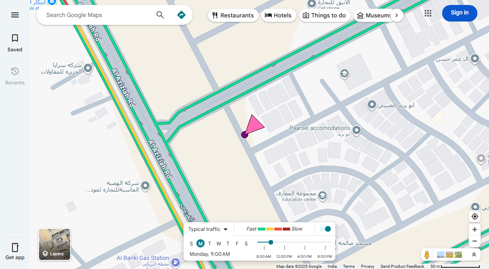 | 28.06 | Accurate: Consistent with light suburban traffic. |
| Loc-14 | 24.96, 46.7 | 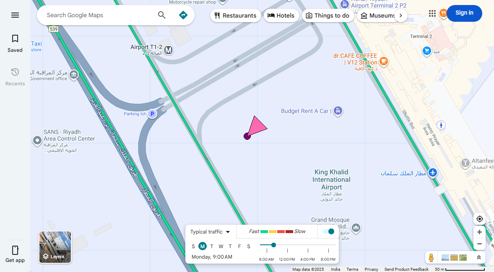 | 28.06 | Accurate: Consistent with light suburban traffic. |
| Loc-15 | 24.6325, 46.715 | 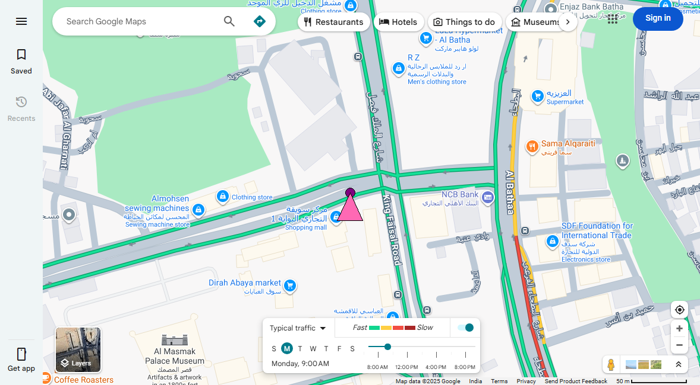 | 30.0 | Accurate: Consistent with light suburban traffic. |

## Remote Testing

| Location | Coordinates | Screenshot | Google Maps Score (Visual) | Justification/Discrepancy Notes |
| --- | --- | --- | --- | --- |
| Loc-16 | 25.0, 46.5 |  | 0.0 | Accurate: No traffic data, consistent with remote location. |
| Loc-17 | 24.3, 46.4 |  | 0.0 | Accurate: No traffic data, consistent with remote location. |

## Notes

- Validation uses only Google Maps visual traffic colors.
